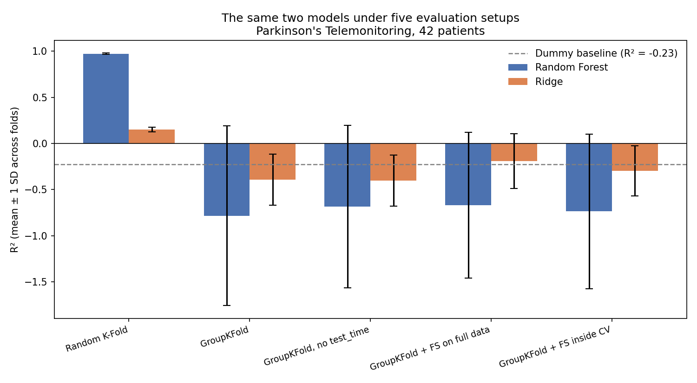

# Leakage vs honest validation

A short study on what happens to a regression score when the data is split
correctly instead of randomly.

## The question

The UCI Parkinson's Telemonitoring dataset contains around 200 voice
recordings from each of 42 patients, and the task is to predict a clinical
severity score from voice measures. Because recordings are repeated per
patient, a random split places the same patient on both sides of the split.
The model can then recognise the patient rather than the condition.

The intended use of such a model is a patient it has never heard before.
This repo compares three evaluation setups to see how much of the reported
performance survives that requirement.

## Setups compared

1. **Random K-Fold** — rows split randomly, patients appear in both folds
2. **GroupKFold by patient** — no patient appears in both train and test
3. **GroupKFold with feature selection inside the CV loop** — selection
   repeated within each fold instead of once on the full dataset

## Results

Random Forest scores R² = 0.97 under random K-Fold and -0.78 under
GroupKFold by patient. Same model, same features, same metric.

The optimistic setup also hides its own uncertainty: standard deviation
across folds is 0.006 under random splitting and 0.97 under patient-level
splitting.

Model ranking reverses. Random splitting makes Random Forest (0.97) look far
better than Ridge (0.15), so you'd drop Ridge on the spot. Under
patient-level splitting Ridge is less bad in every setup. The flexible model
wasn't better at the task, it was better at exploiting the leak.

The leak isn't one column. Removing `test_time` recovers part of the gap for
Random Forest and nothing for Ridge; the shortcut sits in the voice measures
themselves, which are speaker-specific.

The feature-selection comparison came out inconclusive. Selecting inside the
CV loop rather than on the full dataset shifts the mean by about 0.07
against a fold-to-fold SD of 0.8-0.9, which is well below the noise.
Reporting that as a finding would repeat the mistake this repo is about.

## The real constraint

5875 rows, but only 42 independent units. GroupKFold trains on 33 patients
and tests on 9, which is nowhere near enough to learn how the voice-severity
relationship shifts between people.

The dataset can support within-patient questions, like tracking progression
in someone already enrolled. It can't support predicting severity for a
patient the model has never heard. Scores above 0.9 on this dataset are
usually answering the first question while looking like they answer the
second.

## Running it

## Reproducing

Open the notebook in Colab, or install `requirements.txt` and run it locally.
The dataset is downloaded automatically.

## Author

İrem Nur Ceylan — MSc Computer Engineering, Ege University
